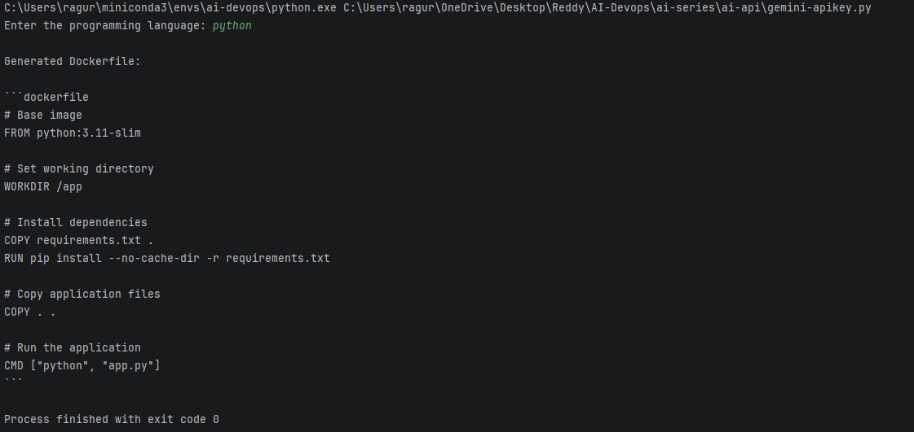

# Dockerfile Generator - Runbook For Olama Endpoint

## Overview

A GenAI-powered tool that generates optimized Dockerfiles based on the programming language provided as input.

This project uses **Ollama** with the **Llama 3.2 1B** model to generate Dockerfiles following containerization best practices.

---

## Prerequisites

Before running the application, ensure the following are installed:

- Python 3.x
- Ollama
- Git (optional)

---

## 1. Install Ollama

### Linux

Install Ollama using:

```bash
curl -fsSL https://ollama.com/install.sh | sh
```

### macOS

Install Ollama using Homebrew:

```bash
brew install ollama
```

### Windows

Download and install Ollama from the official Ollama website.

After installation, verify it:

```bash
ollama --version
```

---

## 2. Start Ollama Service

Start the Ollama service:

```bash
ollama serve
```

> **Note:** Keep this terminal running while using the Dockerfile Generator.

If Ollama is already running as a background service, you can proceed to the next step.

---

## 3. Pull the Llama Model

Pull the required Llama model:

```bash
ollama pull llama3.2:1b
```

Verify that the model is available:

```bash
ollama list
```

Expected output should include:

```text
llama3.2:1b
```

---

# Project Setup

## 4. Clone the Repository

If the project is hosted in Git:

```bash
git clone <repository-url>
```

Navigate to the project directory:

```bash
cd <project-directory>
```

---

## 5. Create a Python Virtual Environment

### Linux / macOS

Create the virtual environment:

```bash
python3 -m venv venv
```

Activate it:

```bash
source venv/bin/activate
```

### Windows PowerShell

Create the virtual environment:

```powershell
python -m venv venv
```

Activate it:

```powershell
.\venv\Scripts\Activate.ps1
```

### Windows Command Prompt

```cmd
python -m venv venv
```

```cmd
venv\Scripts\activate
```

Verify Python:

```bash
python --version
```

---

## 6. Install Dependencies

Make sure the virtual environment is activated.

Install the required Python dependencies:

```bash
pip install -r requirements.txt
```

Verify installed packages:

```bash
pip list
```

---

# Running the Application

## 7. Start the Dockerfile Generator

Run the application using:

### Linux / macOS

```bash
python3 ollama-api.py
```

### Windows

```powershell
python ollama-api.py
```

---

## 8. Provide Programming Language

The application will prompt:

```text
Enter the programming language:
```

For example:

```text
python
```

The application will send the request to the local Ollama Llama model and generate a Dockerfile.

---

# Example

### Input

```text
Enter the programming language: python
```

### Expected Output



---

# Troubleshooting

## Ollama command not found

If you see:

```text
ollama: command not found
```

Verify that Ollama is installed and available in the system `PATH`.

Check:

```bash
ollama --version
```

---

## Ollama service is not running

If the application cannot connect to Ollama, start the service:

```bash
ollama serve
```

Then verify the service:

```bash
ollama list
```

---

## Model not found

If you see an error indicating that the model is unavailable, pull the model again:

```bash
ollama pull llama3.2:1b
```

Verify:

```bash
ollama list
```

---

## Python dependency error

If you see:

```text
ModuleNotFoundError
```

Make sure the virtual environment is activated and reinstall dependencies:

```bash
pip install -r requirements.txt
```

---

# End-to-End Flow

```text
User
  |
  v
Enter Programming Language
  |
  v
ollama-api.py
  |
  v
Ollama
  |
  v
Llama 3.2 1B
  |
  v
Generate Dockerfile
  |
  v
Display Dockerfile
```

---

# Verification Checklist

Before considering the setup complete, verify:

- [ ] Python is installed
- [ ] Ollama is installed
- [ ] Ollama service is running
- [ ] `llama3.2:1b` model is downloaded
- [ ] Python virtual environment is created
- [ ] Virtual environment is activated
- [ ] `requirements.txt` dependencies are installed
- [ ] `ollama-api.py` runs successfully
- [ ] Dockerfile is generated for the requested programming language

---

# Quick Start

For an already configured environment:

```bash
ollama serve
```

In another terminal:

```bash
ollama pull llama3.2:1b
```

Activate the virtual environment:

```bash
source venv/bin/activate
```

Install dependencies:

```bash
pip install -r requirements.txt
```

Run the application:

```bash
python ollama-api.py
```

---

# Dockerfile Generator - Runbook For Gemini Endpoint

---
1. **Install dependency**
   ```bash
   pip install google-genai
   ```

2. **Configure API key**
   Set the Google API key as an environment variable instead of hardcoding it:
   ```bash
   export GOOGLE_API_KEY="your-api-key"
   ```

3. **Save the script**
   Save the Python code as:
   ```bash
   gemini-apikey.py
   ```

4. **Run the script**
   ```bash
   python gemini-apikey.py
   ```

5. **Provide language & verify output**
   Enter a language such as:
   ```text
   Python
   ```
---

# Example

### Input

```text
Enter the programming language: python
```

### Expected Output


---